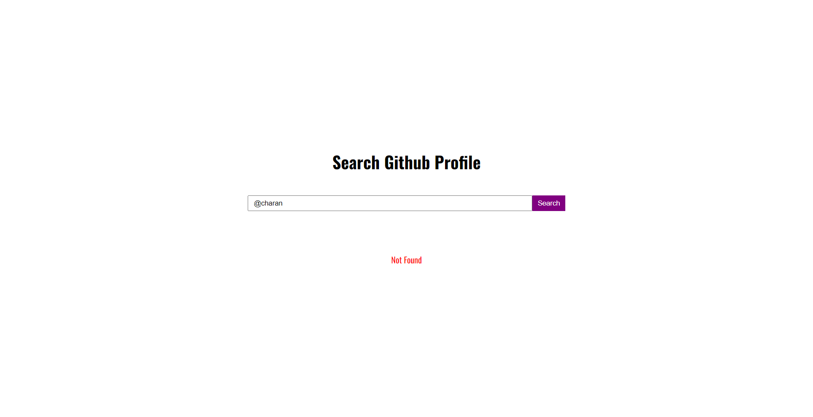

<h1 align="center" id="title">Github-Profile-Search</h1>

This is my First Project Web development and HereYou can type user name on the website &amp; it will show the profile of the user along with bio of the user. If you want the information of the user you need to click the "check profile"

<h2>🚀 Demo</h2>

[https://anishjain34.github.io/Github-Profile-Search/](https://anishjain34.github.io/Github-Profile-Search/)

<h2>Project Screenshots:</h2>

  
  
<h2>💻 Built with</h2>

Technologies used in the project:

*   Html
*   Css
*   Javascript
